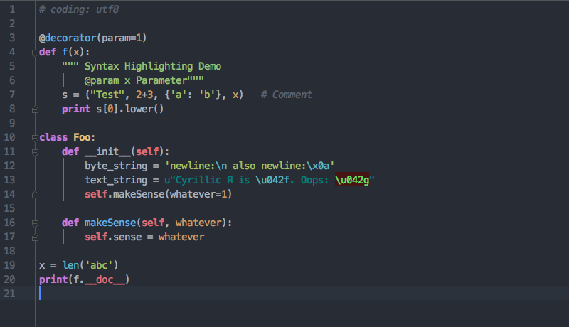

# One Dark PyCharm theme

[One Dark](https://github.com/atom/one-dark-syntax) theme for IntelliJ IDEA, PhpStorm, PyCharm, RubyMine, WebStorm

## Installation

### Option 1: Install using "Import Settings..."

1. Go to `File | Import Settings...` and specify the `idea-one-dark-theme` directory or the `settings.jar` file.
 Click `OK` in the dialog that appears.

2. Restart IntelliJ IDEA

3. Go to `Preferences | Editor | Colors & Fonts` and select one of the new 
color themes.

### Option 2: Manual installation

1.  Copy `One Dark.icls` to your IntelliJ IDEA preferences
    color directory. The directory varies, depending on which JetBrains IDE you are using. 

    *The colors directory may need to be created.*

    It is typically in:

    **Mac OS X**

    * IntelliJ IDEA: `~/Library/Preferences/IntelliJIdea{version}/colors`
    * WebStorm `~/Library/Preferences/WebStorm{version}/colors`
    * PyCharm `~/Library/Preferences/PyCharm{version}/colors`

    **Windows**
    * IntelliJ IDEA `%USERPROFILE%\.IdeaIC{version}\config\colors` 
    * PyCharm `%USERPROFILE%\.PyCharm{version}\config\colors`

2. Restart IntelliJ IDEA

3. Go to `Preferences | Editor | Colors & Fonts` and select one of the new 
color themes.

## ToDo

- [x] Python
- [x] Django/Jinja2 template
- [x] CoffeeScipt
- [x] JavaScript
- [x] CSS
- [x] LESS
- [x] YAML
- [x] JSON
- [x] HTML
- [x] XML
- [x] Golang
- [ ] Java
- [ ] Ruby
- [ ] PHP
- [ ] UI theme

---

## Thanks

- [Wali Akande](https://github.com/eskadah)
